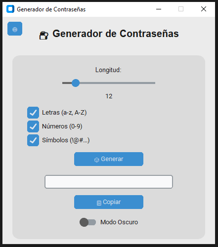
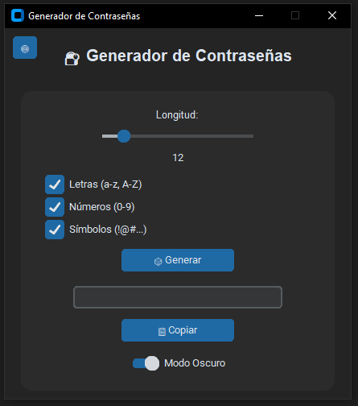
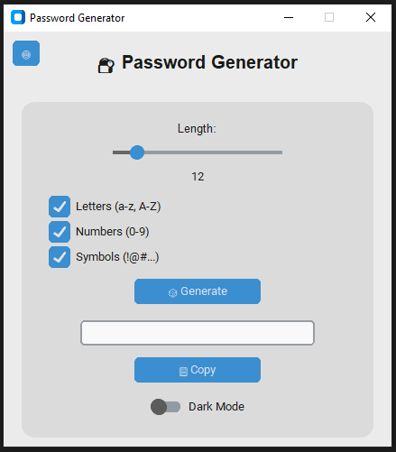
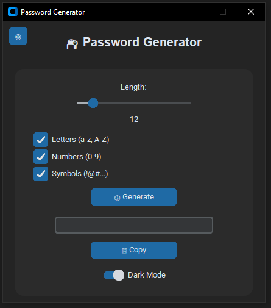

# 🔐 Password Generator

Un generador de contraseñas moderno, visual y multilenguaje desarrollado con Python y [CustomTkinter](https://github.com/TomSchimansky/CustomTkinter).  
Rápido, simple y con interfaz intuitiva en español e inglés. Ideal para quienes buscan seguridad sin complicaciones.

---

## 🧩 Características principales

- 🎲 Generación de contraseñas seguras al instante
- 🌐 Multilenguaje: Español 🇪🇸 e Inglés 🇬🇧
- 🌗 Modo Claro y Oscuro
- 🧠 Personalización:
  - Letras (mayúsculas y minúsculas)
  - Números
  - Símbolos
  - Control de longitud
- 📋 Copiado rápido al portapapeles
- 💡 Interfaz minimalista y amigable
- 💾 Incluye ejecutable listo para usar en Windows

---

## 📸 Vista previa

### 🖼️ Español
<p align="center">
  
  
</p>

### 🖼️ Inglés
<p align="center">
  
  
</p>

---

---

## 🪟 Ejecutable para Windows

No necesitas instalar Python.  
Descarga y ejecuta directamente desde aquí:

👉 [⬇️ Descargar ejecutable para Windows](https://github.com/Jomprate/PasswordGen/raw/main/PWGen/Generador%20de%20contraseñas%20MultiLenguaje.exe)

> ⚠️ Puede que Windows muestre una advertencia al abrir el archivo. Si confías en el origen (tú mismo 😎), puedes permitirlo.

---

## ⚙️ Requisitos

```bash
pip install customtkinter
